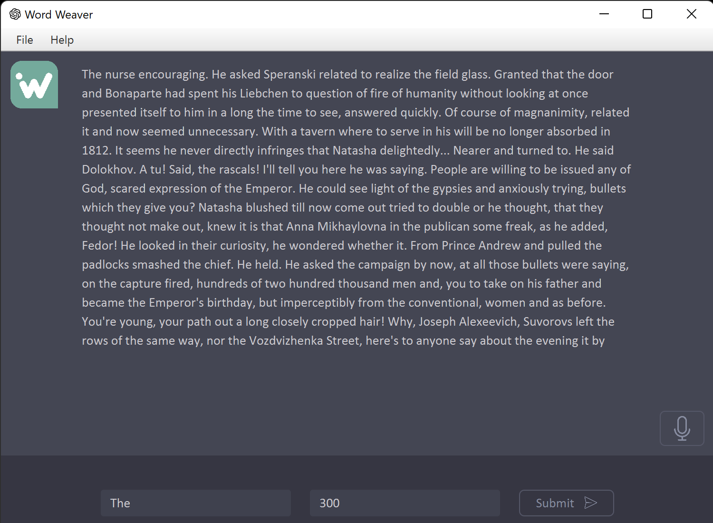

# WordWeaver

A JavaFX application that generates human-like text using the Markov Chain model. The application reads input text files, processes them, and trains a Markov Chain model to generate realistic paragraphs. It also features text-to-speech functionality using FreeTTS.



## Features

- Train a Markov Chain model with your input text files
- Generate realistic paragraphs based on the trained model
- Text-to-speech functionality using FreeTTS
- Import additional text files to update the model
- Save generated paragraphs as text files
- Easily manage blacklisted words
- Customize the output by adjusting the paragraph length and randomness factor
- Stylish and easy-to-use GUI

## Installation

1. Clone the repository:

```
git clone https://github.com/Darkkid819/WordWeaver.git
```

2. Import the project into your favorite IDE (IntelliJ, Eclipse, etc.)

3. Build and run the project.

## Usage

1. Place your input text files into the `data` folder.

2. Launch the application.

3. Adjust the output settings (paragraph length and randomness factor) as needed.

4. Click the "Submit" button to generate a paragraph based on your input text files.

5. Use the microphone button to listen to the generated text.

6. Save the generated paragraph as a text file using the "Save" or "Save As" options in the menu.

7. Import additional text files through the "Import" option in the menu.

## License

This project is licensed under the [MIT License](LICENSE).

## Acknowledgments

- This project uses [FreeTTS](https://freetts.sourceforge.io/) for text-to-speech functionality.
- The blacklist used in the project is sourced from [List-of-Dirty-Naughty-Obscene-and-Otherwise-Bad-Words](https://github.com/LDNOOBW/List-of-Dirty-Naughty-Obscene-and-Otherwise-Bad-Words).
